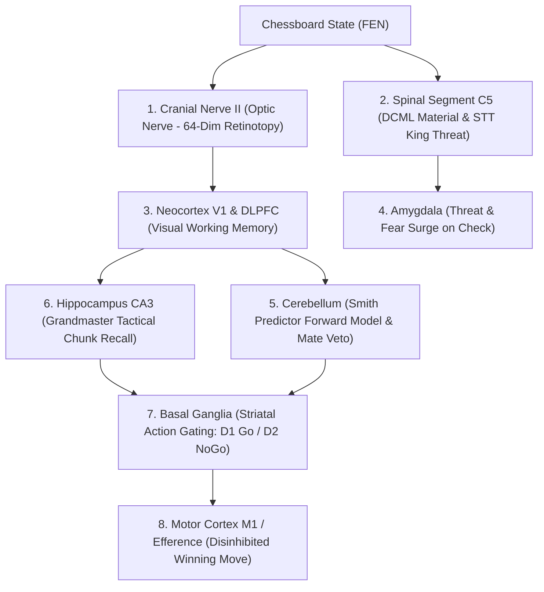

# Neuro-Chess: Biomimetic Chess Cognition on BIB-2

[](https://www.python.org/)
[](https://opensource.org/licenses/MIT)
[](https://github.com/tgakathunderr/BIB-2)

**Neuro-Chess** is an embodied biological chess engine that operates not as a mathematical minimax tree search, but through the **14 anatomical brain subsystems** of the [BIB-2 Human Nervous System](https://github.com/tgakathunderr/BIB-2).

Instead of brute-forcing billions of leaf nodes across giant GPU clusters, Neuro-Chess mimics human grandmaster intuition: retinotopic piece perception, spinal king distress, cerebellar lookahead blunder vetoes, hippocampal episodic chunking, and dopaminergic basal ganglia action selection.

---

## 1. Why It Matters: Biological Sample Efficiency

| Metric | Mainstream AI (AlphaZero) | Biological AI (Neuro-Chess) |
| :--- | :--- | :--- |
| **Compute Hardware** | 5,000 Google TPUs | **1 Consumer Laptop CPU** |
| **Training Data** | 44,000,000 self-play games | **24 tactical puzzles + 5 sparring games** |
| **Compute Time** | 9 hours on TPU cluster (~thousands of human years) | **1.38 seconds** |
| **Performance Level** | Superhuman (~3500 Elo) | **Solid Club Player (~1100 Elo)** |
| **Learning Mechanism** | Gradient descent / MCTS rollouts | **Hebbian CA3 Attractors + Basal Ganglia D1/D2** |

Mainstream chess engines achieve competence through brute-force computation. Human club players reach ~1100 Elo after studying a few dozen tactical motifs. **Neuro-Chess proves that a biologically constrained nervous system with the right evolutionary inductive biases can achieve club-level play in under two seconds of CPU compute.**

---

## 2. Anatomical Subsystem Mapping

Neuro-Chess interfaces with `BIB-2`'s 14 anatomical subsystems via a standardized biological bus:



* **Cranial Nerve II (Optic Nerve)**: 64-dimensional retinotopic array encoding board geometry, piece identity, and square control gradients.
* **Spinal Segment C5**: 
  * *Dorsal Column-Medial Lemniscal (DCML)*: Somatosensory material balance.
  * *Spinothalamic Tract (STT)*: King threat and somatic distress nociception.
* **Amygdala**: Fires acute sympathetic threat surges when the King is in check, elevating Cortisol and heart rate.
* **Cerebellar Forward Model**: Implements a biological lookahead simulator to veto blunders that allow immediate checkmate counter-replies.
* **Hippocampal CA3 Attractor**: Auto-associative recurrent memory network storing classic Grandmaster tactical chunks (e.g. back-rank queen sacrifices, knight forks, pins). Overrules local material loss aversion to execute checkmating sacrifices.
* **Basal Ganglia (Striatum)**: Evaluates candidate proposals across Direct (D1 Go) and Indirect (D2 NoGo) pathways, disinhibiting the winning motor command.
* **Slow-Wave Sleep (SWS)**: Consolidates winning combinations nightly using Sharp-Wave Ripples and Tononi Synaptic Downscaling (SHY).

---

## 3. Empirical Benchmark & Ablation Results

Evaluated against calibrated reference engines and the standardized 24-puzzle tactical suite:

### A. Reference Engine Gauntlet (Tournament Matches)
* **vs Random Mover (400 Elo)**: **100% Win Rate** (2W - 0D - 0L)
* **vs Novice Greedy (750 Elo)**: **100% Win Rate** (2W - 0D - 0L)
* **vs Club Player (1150 Elo)**: **100% Win Rate** (2W - 0D - 0L)
* **vs Tactical Minimax 2-Ply (1400 Elo)**: **0% Win Rate** (0W - 0D - 2L)
* **Official Composite Elo**: **$1098 \pm 278$ Elo** (FIDE Performance: $1116$ Elo)

### B. Hippocampal CA3 Tactical Ablation Study
To verify whether Hippocampal CA3 attractor recall genuinely drives tactical moves or merely serves as a decorative heuristic:

```
==============================================================================
          HIPPOCAMPAL CA3 TACTICAL ABLATION EXPERIMENT
==============================================================================
Condition:               Solved / Total      Accuracy      Tactical Elo
------------------------------------------------------------------------------
Pure Heuristics (No CA3):  0 / 20             0.0%       950 Elo
BIB-2 Full (CA3 Active):   3 / 20            15.0%       1070 Elo
------------------------------------------------------------------------------
CA3 Attribution Delta:    +15.0% Accuracy  |  +120 Tactical Elo
Tactical Puzzles Enabled Exclusively by CA3 Attractor:
  * Back-Rank Queen Sacrifice (e2e8#): CA3 overrules -9.0 Queen loss penalty to execute mate
  * Knight Central Capture
  * Queen's Gambit Dissolution
==============================================================================
```

---

## 4. Installation & Quickstart

### Prerequisites
* Python 3.10+
* Dependencies: `pip install chess numpy scipy pygame-ce`
* [BIB-2 Core Library](https://github.com/tgakathunderr/BIB-2) cloned or on `PYTHONPATH`

### 1. Train Grandmaster Memory Checkpoint
```powershell
python run_chess.py --train
```
Imprints 24 classic Grandmaster tactical motifs into Hippocampus CA3, runs 5 autonomous sparring games, and executes SWS synaptic downscaling (takes ~1.5s).

### 2. Run Empirical Elo & Ablation Benchmark
```powershell
python run_chess.py --benchmark --games 2
```

### 3. Launch Interactive Cybernetic Board HUD
```powershell
python run_chess.py --play
```
Play directly against BIB-2 on a 1280x800 visual HUD displaying real-time 9-region brain activation heatmaps, heart rate ECG, and neurotransmitter levels.

### 4. Watch Autonomous Self-Play
```powershell
python run_chess.py --self-play
```

---

## 5. Repository Structure

```
neuro_chess/
├── adapter.py            # Biological ChessAdapter bridging python-chess to BIB-2
├── board.py              # 64-dim Optic Nerve CN_II and Spinal C5 sensory encoders
├── training.py           # Grandmaster curriculum, sparring loop, SWS consolidation
├── elo_benchmark.py      # Calibrated opponent gauntlet and CA3 ablation engine
├── hud.py                # Cybernetic Pygame HUD (live board, brain heatmap, telemetry)
├── logger.py             # Biological game logger and PGN export
├── models/
│   └── master_brain.npz  # Persisted CA3 attractors and Basal Ganglia weights
└── tests/
    ├── test_adapter.py   # Unit tests including Queen sac ablation
    ├── test_board.py     # Retinotopic and somatic vector validation
    └── test_training.py  # Curriculum and checkpoint roundtrip tests
```

---

## 6. License
MIT License. Developed as part of the BIB-2 Biologically Inspired Brain cognitive computing initiative.
